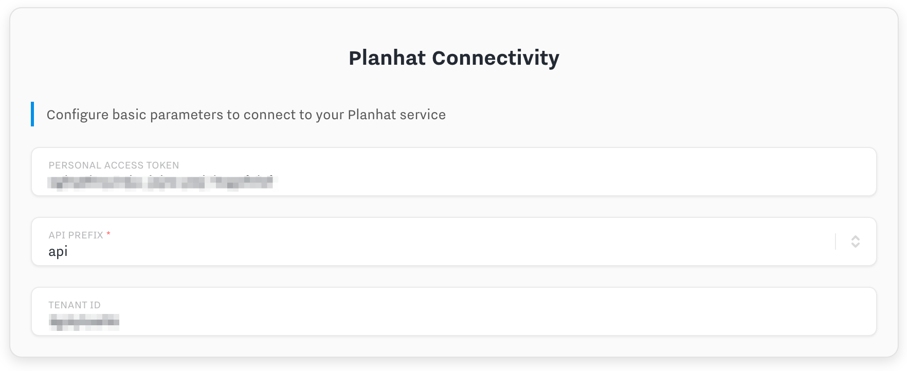
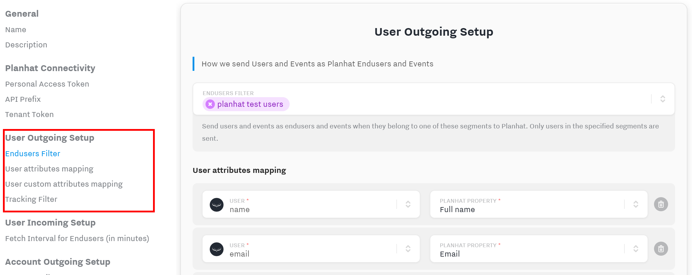
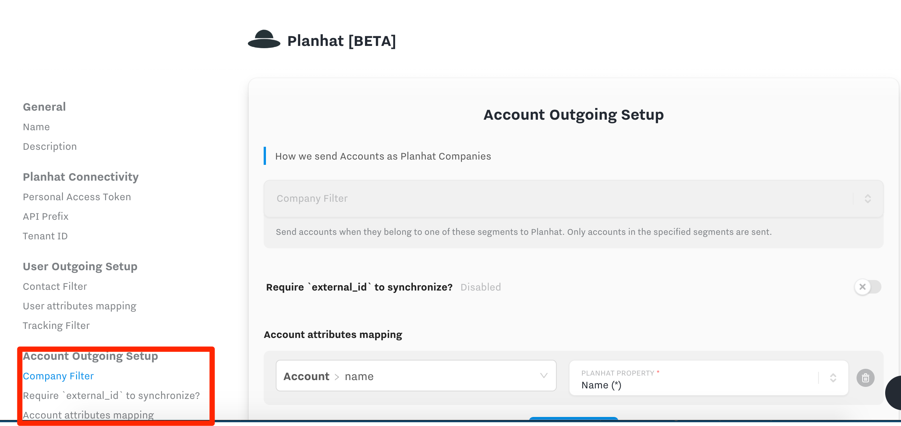
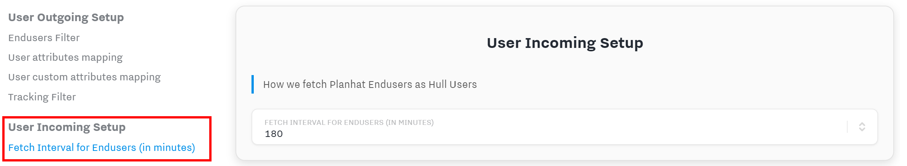
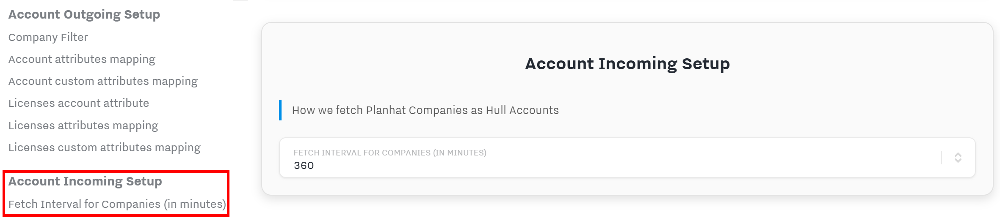

# Hull - Planhat Connector

This Connector enables you to synchronize Hull users and accounts to Planhat endusers and companies and also allows you to track events in Planhat.

This document was last updated on May 1, 2020. If you want to help us improve this documentation or have some feedback, please feel free to [open a GitHub issue](https://github.com/hull/hull-planhat/issues/new)!

## Getting Started

1. From your Hull Connectors page click on `[Add a Connector]`
2. Search for "Planhat" and click on `[Install]`
3. Authorize Hull to send data on your behalf by configuring the Planhat Connectivity section:
   
   Please obtain the `Personal Access Token` and `Tenant Token` from Planhat as well as the `API Prefix`. If you need help in obtaining any of this information, please refer to the [Planhat documentation](https://docs.planhat.com).

## Control outgoing data flow

### User data from Hull to Contacts in Planhat

You can synchronize user attributes from Hull with Planhat Endusers by specifying one or more user segments in the `Endusers Filter` and configuring the required mappings under `User attributes mapping`:

_Note_: If you plan to send events, keep in mind that the segments used in the filter cannot have the event as a condition, because evaluation takes place after the event had occured. So the Connector won't recognize that the user is in the segment in time, thus resulting in the event not being tracked in Planhat. We recommend to use a generic segment, e.g. users with external_ids, which ensures that users will be in the segment before the event is registered.

The Connector will check the conditions in the following order:

1. Check if the user is in one of the segments listed under `Endusers Filter`
2. Check if a new event occured which is in the `Tracking Filter`

The Connector will send events with the `action` set to name of the event in Hull and all properties passed as `info` parameter to the Planhat API. If present, the name, email and external_id of the Hull user will be sent along to attribute the event to the appropriate Enduser in Planhat.

### Account data from Hull to Companies in Planhat

You can synchronize account attributes from Hull with Planhat companies by specifying one or more account segments in the `Company Filter` and making the required mappings under `Account attributes mapping`:

Only accounts with an `external_id` in Hull can be synchronized to Planhat to ensure proper deduplication.

If you want the Connector to assign `Owner` and `Co-Owner` in Planhat, you need to specify an attribute which has the value of the Planhat ID of the User, who should be the owner or co-owner. If you send an invalid value, the payload will be rejected by the Connector and no API call to Planhat will be executed; in this case the Connector will log an `outgoing.account.skip` message with a reason of `Invalid Owner ID` or `Invalid Co-Owner ID`.

_This feature is available since version 0.1.5_.

_Note_: The account must be in one of the whitelisted segments. The Connector won't synchronize a linked account based on the fact that the user matches a whitlisted segment in the `Endusers Filter`.

#### Synchronization of Licenses

Licenses are dependent objects from companies in Planhat. Hull doesn't have a dedicated object for licenses, but the Planhat Connector enables you to synchronize an account attribute which needs to be of type `JSON`. This JSON attribute needs to be an array of objects and can be configured under `Licenses account attribute`.

The next step to synchronize licenses is to specify the mappings for each object in the JSON array under `Licenses attributes mapping`. There is no input help available for the Hull Attribute, so be careful when mapping the data, since the entries are case-sensitive. To avoid issues, you should stay clear of using spaces in the attributes stored in Hull.

You also have the option to map custom attributes for licenses, please refer to the [Planhat docs](https://docs.planhat.com/?version=latest#0a0754bd-9def-4e21-afc4-0d0f2e3b58dd) for further details and best practices.

_This feature is available since version 0.1.6_.

### Control Incoming Data Flow

#### Fetching of Endusers

The Connector fetches Planhat Enduser data on a scheduled interval, which can be configured in the Settings in the section `User Incoming Setup` as shown below:

Since there is no change detection on the Planhat API, the Connector performs a full fetch, iterating over the entire portfolio in Planhat. The Connector has an internal mechanism to filter only updated Endusers since the last fetch to reduce the number of incoming requests in Hull, which is a billable metric.

_This feature is available since version 0.1.7_.

_Pro Tip:_ If you are uncertain about the proper interval, choose a higher one and review the `Logs` tab of the Connector to determine the job duration. You can filter for `message: incoming.job.success` in the logs and look at the data column, which contains the start and end timestamp.

#### Fetching of Companies

The Connector fetches Planhat Company data on a scheduled interval which can be configured in the Settings in the section `Account Incoming Setup`:

Since there is no change detection on the Planhat API, the Connector performs a full fetch, iterating over the entire portfolio in Planhat. Keep in mind that every company in Planhat will result in one incoming request in Hull, which is a billable metric.

_This feature is available since version 0.1.7_.

_Pro Tip:_ If you are uncertain about the proper interval, choose a higher one and review the `Logs` tab of the Connector to determine the job duration. You can filter for `message: incoming.job.success` in the logs and look at the data column which contains the start and end timestamp.

### Internal API

The Connector exposes an internal API which you can leverage in the Processor to perform additional operations while using the configured authentication of your Planhat Connector.

**Warning:** This is an advanced feature of the Connector and you are responsible for implementing the proper logic yourself. Please consult the Planhat documentation for additional information and/or Hull Support.

#### Authentication

The internal API is secured with Basic Auth using the credentials of the Connector:

| Basic Auth | Connector Credential |
| ---------- | -------------------- |
| Username   | Connector ID         |
| Password   | Connector Secret     |

The organization needs to be passed along as querystring parameter `org`. Requests which are not properly authenticated will be rejected with error codes `400`, `401` or `403`.

#### Users

The Connector exposes an internal API which allows the management of Users in Planhat to list, read, create or update users.

| ID           | Endpoint                    | Method | Description                  |
| ------------ | --------------------------- | ------ | ---------------------------- |
| users.list   | /api/internal/users         | GET    | List all users (cached)      |
| users.get    | /api/internal/users/:userId | GET    | Get a user by its Planhat ID |
| users.create | /api/internal/users         | POST   | Create a new user            |
| users.update | /api/internal/users/:userId | PUT    | Update an existing user      |

The users endpoints are a wrapper around the Planhat API endpoints for Users as documented [here](https://docs.planhat.com/?version=latest#e6b6e1a8-e175-404b-8daf-71554c8c4264).

**Note:** The list endpoint uses a caching mechanism and keeps results up to 10 minutes in the cache. To force cache invalidation use the querystring parameter `&cacheclear=1`.

## FAQ

### Why do you require an external ID for accounts to synchronize data to Planhat

The Connector needs to be able to synchronize data reliably and without any side-effects to Planhat, thus also not creating duplicate accounts. Since the `externalId` is the only truly unique field on the `Company` object, the Connector can only rely on this field for the purpose of deduplication when sending data to the Planhat API.

### What is the reason that you require the account being in a whitelisted segment to synchronize users

Planhat is centered around the `Company`, which is in Hull equal to the `Account`. Resembling this mindset we have decided the `Account` to be the leading object for the synchronization to Planhat.
Requiring the account being in a whitelisted segment enables you to use the filter for users to further narrow down the `Endusers`, which the Connector updates. A practical example: you might store in Hull all users linked to a given account, whether they use your product or not. But for your Customer Success team to be effective, you only want to synchronize users that are using your product. This becomes easy with the combined filtering logic. You can use the account filter to narrow down the accounts to customers only, excluding for example internal accounts. Now all you need to do is to create a user segment which resembles all active users of your product, and the Connector combines both segments. If you want to synchronize additional users for customer accounts later, you just add a new user segment and additional endusers will be kept in sync.

### Why can I not choose a more frequent interval to fetch updates from Planhat

The Planhat API doesn't have endpoints to fetch only recently updated objects or has sufficient webhooks to cover the needs for data synchronization as of now. Hence the Connector needs to page through your entire portfolio and pull all data in. Depending on the size of your data collection this can result in a large amount of data being transferred into Hull and long running jobs. This poses stability issues for long running jobs on the one hand and on the other hand results in many incoming requests, which are a billable metric in Hull. To prevent a lot of stress on both platforms, the available intervals are limited.

### Where can I find the changelog for the Connector

You can find the changelog on GitHub detailing what features have been added, what bugfixes have been applied and what technical maintenance measures have been taken: [Changelog](https://github.com/hull/hull-planhat/blob/master/CHANGELOG.md).
